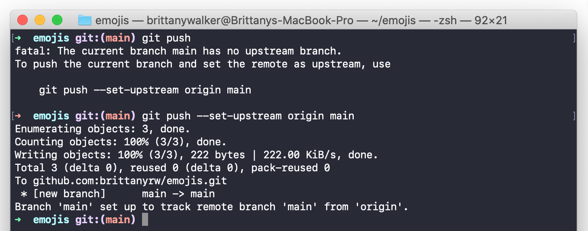

# Intro to Git & Github


## Table of Contents
* 👋🏾 [Introduction](#introduction)
* 🤔 [What is Git?](#what-is-git)
* 🧐 [What is Github?](#what-is-github)
* 🛠 [Git and Github Setup](#git-and-github-setup)
* 👩🏾‍💻 [Command Line](#command-line)
* 🦄 [Git Commands](#git-commands)
* 🥳 [Practice and Contribute](#practice-and-contribute)

## 👋🏾 Introduction

## 🤔 What is Git?


## 🧐 What is Github?


## 🛠 Git and Github Setup
Below are instructions for how to set up Git and Github on your computer.

* Create an account on Github - https://github.com/join
* Download and install Git - https://git-scm.com/downloads
  * For Macs: if you do not already have homebrew installed and are not familiar with using the command line, you can use the Binary installer.
* Download a Text Editor. A text editor is a program that you use to modify and write code. If you do not already have a text edtior, here are some suggestions: 
  *  [Sublime Text](https://www.sublimetext.com/)
  *  [Visual Studio Code](https://code.visualstudio.com/)
  *  [Atom](https://atom.io/)

## 👩🏾‍💻 Command Line

The command line is a text interface that you can use to run commands on your computer. Mac (Terminal) and Windows (Command Prompt) computers both come with default command lines. You can find and open these command lines by searching for the name (Terminal or Command Prompt) on your computer. 

### Alternative Command Lines
* [iTerm2 (Mac)](https://iterm2.com/): Powerful terminal replacement for macOS
* [Hyper.js](https://hyper.is/): A beautiful, feature filled terminal created with Electron.js
* [Terminus (Windows, macOS and Linux)](https://eugeny.github.io/terminus/): A highly configurable terminal emulator
* [eDEX-UI](https://github.com/GitSquared/edex-ui) - A TRON/Sci-fi inspired terminal
* Git Bash (Windows - is including when you download [Git for Windows](https://git-scm.com/downloads)) 

### Command Line Resources
* [Terminal (Mac) Command Line Cheatsheet](https://github.com/0nn0/terminal-mac-cheatsheet): A cheatsheet for the Terminal (Mac) command line.
* [Command Prompt (Windows) Command Line Cheatsheet](http://www.cs.columbia.edu/~sedwards/classes/2015/1102-fall/Command%20Prompt%20Cheatsheet.pdf): A cheatsheet for Command Prompt (Windows).
* [Command Line Power User](https://wesbos.com/command-line-video-tutorials/): A free video course that walks you through customizing your terminal and increasing functionality.

## 🦄 Git Commands


### Git Init

Initializes Git
Tells Git to start tracking your files
Run inside of a directory (folder)

### Git Status

Outputs the status of your files
What branch you are on
Which files are being tracked
Which files have been altered
Local branch vs remote branch

### Git Add

Tells Git which files to add to the staging area
Can add all files
Can add individual files

### Git Commit

```git commit``` saves a snapshot of your entire project. You run the command with the `-m` flag to include a message. This message will typically explain what was changed in the code. Here is an example of what running ```git commit``` could look like: ```git commit -m “your commit message here”```. You should commit often!
* Further Reading:
  * [BitBucket Git Commit](https://www.atlassian.com/git/tutorials/saving-changes/git-commit)
  * [GitHub Git Commit Guide](https://github.com/git-guides/git-commit)
  * [Official Git Documentation](https://git-scm.com/docs/git-commit)

### Git Push

Sends code from your local branch to your remote branch. In this case, it is sending to Github.

## Additional Commands
Other commands you should start to learn include: ```git clone```, ```git checkout```, ```git pull```, ```git log```, ```git merge```

## 📚 Git & Github Resources
- [GitHub Git Command Cheatsheet](https://github.github.com/training-kit/downloads/github-git-cheat-sheet.pdf): A cheatsheet of the most commonly used Git commands, published by GitHub.
- [GitHub Learning Lab](https://lab.github.com/): Learn GitHub and Git through guided projects.
- [Getting Git Right](https://www.atlassian.com/git): Tutorials and guides for using Git.
- [Learn Git Branching](https://learngitbranching.js.org/): An interactive tool to help you visualize how branching in Git works.
- [How to Use Git - A Reference Guide](https://dev.to/digitalocean/how-to-use-git-a-reference-guide-6b6): Extensive cheat sheet, explanations and resources for using Git
- [Dangit, git!](https://dangitgit.com/): A list of common git commands used to undo changes.

## 🥳 Practice and Contribute
Alright, so you now know the basics of using Git and Github. What's next? To become more comfortable using the command line, Git and Github you're going to need to practice. Below is a list of a few suggestions for how to practice on your own and a list of open source projects that have extensive contribution documentation that makes it easier for beginners to contribute. 

## How to Practice

- Personal Projects
- 100 Days of Code
- Coding Challenges like [Codepen Challenges](https://codepen.io/challenges)
- Follow people on Github 👀

## Projects to Contribute to


- [EmojiScreen](https://github.com/brittanyrw/emojiscreen) - A listing of movies, TV shows and musicals depicted through emojis (created by me!)
- [Forem/Dev.to](https://docs.forem.com/contributing/forem/) - Open source software for building communities
- [Gatsby](https://www.gatsbyjs.com/contributing/) - Build blazing fast, modern apps and websites with React
- [Netlify CMS](https://github.com/netlify/netlify-cms/blob/master/CONTRIBUTING.md) - A Git-based CMS for Static Site Generators
- [P5.js](https://p5js.org/contributor-docs/#/) - A JavaScript library for creative coding
- [FreeCodeCamp](https://contribute.freecodecamp.org/#/index) - A friendly community where you can learn to code for free
