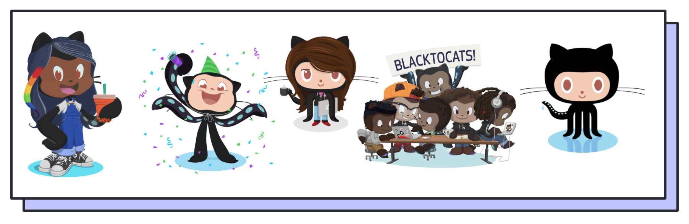

# Intro to Git & GitHub - Presentation Here: https://github.com/brittanyrw/git/


## Table of Contents
* 👋🏾 [Introduction](#introduction)
* 🤔 [What is Git?](#what-is-git)
* 🧐 [What is GitHub?](#what-is-github)
* 🛠 [Git and GitHub Setup](#git-and-github-setup)
* 👩🏾‍💻 [Command Line](#command-line)
* 🦄 [Git Commands](#git-commands)
* 🥳 [Practice and Contribute](#practice-and-contribute)

## 👋🏾 Introduction
This is supporting documentation for an Intro to Git & GitHub Workshop. You will learn about Git and GitHub, some of the most popular version control tools. We will cover the command line, commonly used Git commands, what open source is and how you can utilize Git and GitHub to manage your own projects and to collaborate with others. 

## 🤔 What is Git?


Git is a version control system used to track and manage changes made to files. This tool allows teams to work more efficently together and avoid mistakes that might arise from conflicting code, bugs and so on. Benefits of using version control include:

* Ability to track **what** code has been changed
* Ability to see **who** has changed it
* Ability to see **when** it was changed 
* And the option to revert to previous versions if needed

Further Reading:
  * [What is Version Control?](https://www.atlassian.com/git/tutorials/what-is-version-control)
  * [GitHub Git Guide](https://github.com/git-guides/)

## 🧐 What is GitHub?


GitHub is a website where you can host code, collaborate with others and utilize Git version control tools. **Note:** Very important to remember that ```Git``` and ```GitHub``` are two different things. Some features of GitHub include: 
* Collaboration (open-source): View other people's code and collaborate on projects.
* Storage: Upload your code to store it remotely vs just on your local machine.
* Hosting: Deploy websites with the option of custom domains
* Management: Automation, manage to do lists (Projects), create Wikis, team organization  
* And much more

Alternatives: [Gitlab](https://about.gitlab.com/) & [Bitbucket](https://bitbucket.org/product)

Further Reading:
  * [GitHub Git Guide](https://github.com/git-guides/)
  * [Features of GitHub](https://github.com/features)

## 🛠 Git and GitHub Setup
Below are instructions for how to set up Git and GitHub on your computer.

* Create an account on GitHub - https://github.com/join
* Download and install Git - https://git-scm.com/downloads
  * For Macs: if you do not already have homebrew installed and are not familiar with using the command line, you can use the Binary installer.
* Download a Text Editor. A text editor is a program that you use to modify and write code. If you do not already have a text edtior, here are some suggestions: 
  *  [Sublime Text](https://www.sublimetext.com/)
  *  [Visual Studio Code](https://code.visualstudio.com/)
  *  [Atom](https://atom.io/)

## 👩🏾‍💻 Command Line

The command line is a text interface that you can use to run commands on your computer. Mac (Terminal) and Windows (Command Prompt) computers both come with default command lines. You can find and open these command lines by searching for the name (Terminal or Command Prompt) on your computer. 

### Alternative Command Lines
* [iTerm2 (Mac)](https://iterm2.com/): Powerful terminal replacement for macOS
* [Hyper.js](https://hyper.is/): A beautiful, feature filled terminal created with Electron.js
* [Terminus (Windows, macOS and Linux)](https://eugeny.github.io/terminus/): A highly configurable terminal emulator
* [eDEX-UI](https://github.com/GitSquared/edex-ui) - A TRON/Sci-fi inspired terminal
* Git Bash (Windows - is including when you download [Git for Windows](https://git-scm.com/downloads)) 

### Command Line Resources
* [Terminal (Mac) Command Line Cheatsheet](https://github.com/0nn0/terminal-mac-cheatsheet): A cheatsheet for the Terminal (Mac) command line.
* [Command Prompt (Windows) Command Line Cheatsheet](http://www.cs.columbia.edu/~sedwards/classes/2015/1102-fall/Command%20Prompt%20Cheatsheet.pdf): A cheatsheet for Command Prompt (Windows).
* [Command Line Power User](https://wesbos.com/command-line-video-tutorials/): A free video course that walks you through customizing your terminal and increasing functionality.

## 🦄 Git Commands

We're going to briefly go over just a few of the most commonly used Git commands below. These will get you started using Git but there are many more commands you can utilize. Check out the resources after this section for more information.

*** 


### Git Init
```git init``` initializes Git. After this command is run, Git will start tracking your files.  

* Run inside of a directory (folder). Any changes you make in that folder will then be tracked by Git.

Further Reading:
  * [Bit Bucket Git Init Guide](https://www.atlassian.com/git/tutorials/setting-up-a-repository/git-init)
  * [GitHub Git Init Guide](https://github.com/git-guides/git-init)
  
***


### Git Status
```git status``` outputs the status of your files. This is a command that is used very often.

Some information git status can give you includes: 
* What branch you are on
* Which files are being tracked
* Which files have been altered
* What the status is of your local branch vs the remote branch

Further Reading:
  * [Bit Bucket Git Status Guide](https://www.atlassian.com/git/tutorials/inspecting-a-repository)
  * [GitHub Git Status Guide](https://github.com/git-guides/git-status)
  
***


### Git Add
```git add``` tells Git which files to add to the staging area before comitting.
* Can add all files: ```git add .```
* Can add individual files: ```git add index.html main.css```

Further Reading:
  * [BitBucket Git Add Guide](https://www.atlassian.com/git/tutorials/saving-changes)
  * [GitHub Git Add Guide](https://github.com/git-guides/git-add)
  
***


### Git Commit
```git commit``` saves a snapshot of your entire project. You run the command with the `-m` flag to include a message. This message will typically explain what was changed in the code. Here is an example of what running ```git commit``` could look like: ```git commit -m “your commit message here”```. You should commit often!
Further Reading:
  * [BitBucket Git Commit Guide](https://www.atlassian.com/git/tutorials/saving-changes/git-commit)
  * [GitHub Git Commit Guide](https://github.com/git-guides/git-commit)
  * [Official Git Documentation](https://git-scm.com/docs/git-commit)

***


### Git Push
```git push``` sends code from your local branch to your remote branch. In this case, it is sending to GitHub.

Further Reading:
  * [BitBucket Git Push Cuide](https://www.atlassian.com/git/tutorials/syncing/git-push)
  * [GitHub Git Push Guide](https://github.com/git-guides/git-push)

## Additional Commands
For a list additional commands you should learn check out this [GitHub Git Command Cheatsheet](https://github.github.com/training-kit/downloads/github-git-cheat-sheet.pdf).

## 📚 Git & GitHub Resources
- [GitHub Learning Lab](https://lab.github.com/): Learn GitHub and Git through guided projects.
- [Getting Git Right](https://www.atlassian.com/git): Tutorials and guides for using Git.
- [Learn Git Branching](https://learngitbranching.js.org/): An interactive tool to help you visualize how branching in Git works.
- [How to Use Git - A Reference Guide](https://dev.to/digitalocean/how-to-use-git-a-reference-guide-6b6): Extensive cheat sheet, explanations and resources for using Git
- [Dangit, git!](https://dangitgit.com/): A list of common git commands used to undo changes.

## 🥳 Practice and Contribute
Alright, so you now know the basics of using Git and Github. What's next? To become more comfortable using the command line, Git and Github you're going to need to practice. Below is a list of a few suggestions for how to practice on your own and a list of open source projects that have extensive contribution documentation that makes it easier for beginners to contribute. 

## How to Practice

- Personal Projects
- 100 Days of Code
- Coding Challenges like [Codepen Challenges](https://codepen.io/challenges)
- Follow people on Github 👀

## Projects to Contribute to


- [EmojiScreen](https://github.com/brittanyrw/emojiscreen) - A listing of movies, TV shows and musicals depicted through emojis (created by me!)
- [Forem/Dev.to](https://docs.forem.com/contributing/forem/) - Open source software for building communities
- [Gatsby](https://www.gatsbyjs.com/contributing/) - Build blazing fast, modern apps and websites with React
- [Netlify CMS](https://github.com/netlify/netlify-cms/blob/master/CONTRIBUTING.md) - A Git-based CMS for Static Site Generators
- [P5.js](https://p5js.org/contributor-docs/#/) - A JavaScript library for creative coding
- [FreeCodeCamp](https://contribute.freecodecamp.org/#/index) - A friendly community where you can learn to code for free
